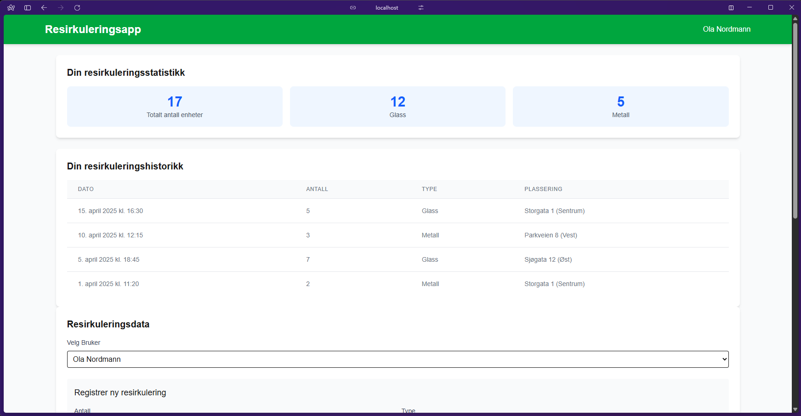
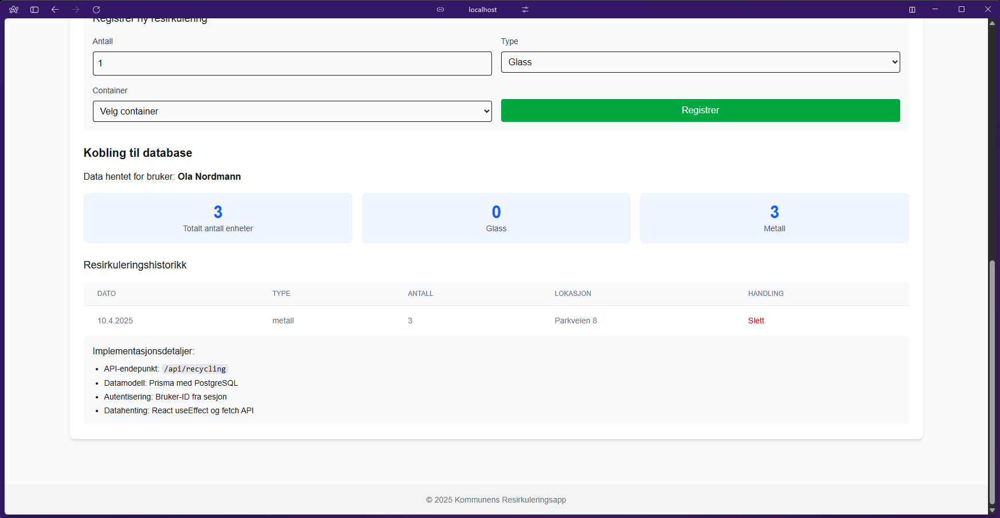
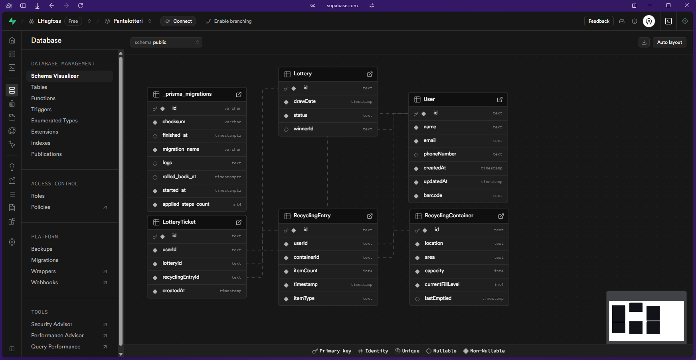

# Pantelotteri App – Resirkuleringssystem for kommunen

Dette prosjektet er en digital løsning for pantelotteri, utviklet med Next.js,
Prisma, Supabase, og Tailwind CSS. Systemet lar innbyggere resirkulere glass og metall,
samtidig som de deltar i lotterier basert på sine innleveringer. Her finner du en detaljert
oversikt over datamodellen, frontend-implementasjonen og backend-integrasjonen.

# Presentasjonsoppgave 2 i Utvikling, våren 2025

## Teknologivalg

Dette prosjektet er bygget med følgende teknologier:

- **Next.js 15** – For moderne frontend-utvikling med App Router.
- **Tailwind CSS** – For rask og fleksibel styling.
- **Prisma ORM** – For enkel databasehåndtering i PostgreSQL.
- **Supabase** – For backend-løsning med PostgreSQL-database.
- **PostgreSQL** – Databaseplattform for lagring av pantedata.
- **TypeScript** – Gir sterk typing og forbedret utvikleropplevelse.
- **Prettier** – For konsistent kodeformattering.
- **ESLint** – For å sikre kodekonsistens og feilretting.

## Oppgave 1: Datamodell for pantelotteri (Backend-struktur)

For kommunens utviklingsprosjekt med panteordning for glass og metall har jeg utviklet følgende datamodell:

### Tabeller og relasjoner

#### 1. User (Bruker)

- **id**: UUID (primærnøkkel)
- **name**: String (brukerens navn)
- **email**: String (unik, brukerens e-post)
- **phoneNumber**: String (brukerens telefonnummer)
- **createdAt**: DateTime (når brukeren ble registrert)
- **updatedAt**: DateTime (når brukeren sist ble oppdatert)
- **barcode**: String (unik personlig strekkode for identifisering)

#### 2. RecyclingContainer (Resirkuleringskontainer)

- **id**: UUID (primærnøkkel)
- **location**: String (kontainerens plassering/adresse)
- **area**: String (området i kommunen)
- **capacity**: Int (kapasitet i antall enheter)
- **currentFillLevel**: Int (nåværende fyllnivå)
- **lastEmptied**: DateTime (når kontaineren sist ble tømt)

#### 3. RecyclingEntry (Resirkuleringsregistrering)

- **id**: UUID (primærnøkkel)
- **userId**: UUID (fremmednøkkel til User)
- **containerId**: UUID (fremmednøkkel til RecyclingContainer)
- **itemCount**: Int (antall enheter resirkulert)
- **timestamp**: DateTime (tidspunkt for resirkulering)
- **itemType**: String (glass eller metall)

#### 4. Lottery (Lotteri)

- **id**: UUID (primærnøkkel)
- **drawDate**: DateTime (dato for trekning)
- **status**: String (planlagt, gjennomført)
- **winnerId**: UUID (fremmednøkkel til User, vinneren)

#### 5. LotteryTicket (Lodd)

- **id**: UUID (primærnøkkel)
- **userId**: UUID (fremmednøkkel til User)
- **lotteryId**: UUID (fremmednøkkel til Lottery)
- **recyclingEntryId**: UUID (fremmednøkkel til RecyclingEntry)
- **createdAt**: DateTime (når loddet ble opprettet)

### Relasjoner

- En bruker kan ha mange resirkuleringsregistreringer (one-to-many)
- En kontainer kan ha mange resirkuleringsregistreringer (one-to-many)
- En bruker kan ha mange lodd (one-to-many)
- Et lotteri kan ha mange lodd (one-to-many)
- En resirkuleringsregistrering genererer ett eller flere lodd (one-to-many)
- Et lotteri har én vinner (one-to-one)

## Oppgave 2: Frontend-implementasjon med Next.js

Jeg har valgt å implementere skjermbilde 1: der en innbygger har oversikt over hvor mange enheter hen har levert til resirkulering.

Implementasjonen er gjort med Next.js 15 med App Router, TypeScript og Tailwind CSS. Jeg har laget en oversiktsside som viser brukerens resirkuleringshistorikk og statistikk.

## Oppgave 3: Backend-integrasjon med Prisma og PostgreSQL

For å hente og vise data fra databasen til panteappen har jeg implementert en løsning med Prisma ORM og PostgreSQL på Supabase. Dette gir en sikker og effektiv måte å kommunisere med databasen på.

Jeg har implementert API-endepunkter for å hente brukerdata, resirkuleringshistorikk og lotteristatus. Dataene hentes ved hjelp av Prisma Client og vises i frontend-komponentene.

## Kilder

- Next.js dokumentasjon: https://nextjs.org/docs
- Prisma dokumentasjon: https://www.prisma.io/docs
- Tailwind CSS dokumentasjon: https://tailwindcss.com/docs
- Supabase dokumentasjon: https://supabase.com/docs
- TypeScript dokumentasjon: https://www.typescriptlang.org/docs
- React dokumentasjon: https://react.dev/reference/react

## Lisens

Dette prosjektet er lisensiert under MIT-lisensen. Se LICENSE.md for mer informasjon.
